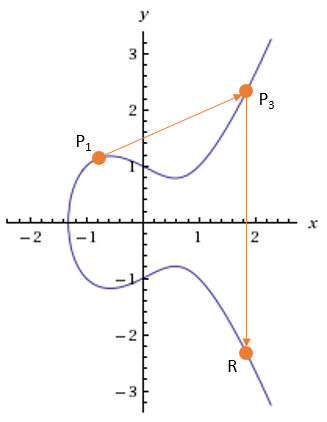

08:00 01/10/2026 Mempelajari lebih dalam fungsi ECDH STS 

menggunakan persamaan kurva eliptik dan perkalian skalar titik untuk menghasilkan kunci rahasia bersama
persamaan kurva eliptik dasar

**y2 = (mod *p*)**

atau secara umum 

**y2 = x3 + ax + b (mod p)**

dengan syarat 4a3 + 27b2 ≠ 0

Parameter Publik yang Disepakati :
- **E**: Kurva eliptik yang digunakan.
- **P** (atau **G**): Titik dasar (base point / generator) pada kurva.

Langkah-Langkah dan Rumus Pertukaran Kunci
1. Pembuatan Kunci oleh Alice
- Kunci Privat (***dA***): Alice memilih angka acak rahasia (***dA***).
- Kunci Publik (***QA***): Alice menghitung titik publiknya dengan perkalian skalar:
***QA*** = ***dA*** X **P**
- Alice mengirim ***QA*** ke Bob.

2. Pembuatan Kunci oleh Bob
- Kunci Privat (***dB***): Bob memilih angka acak rahasia (***dA***).
- Kunci Publik (***dA***): Bob menghitung titik publiknya:
***QB*** = ***dB*** X **P**
- Bon mengirim ***QB*** ke Alice.

3. Perhitungan Kunci Bersama (Shared Secret)
- Alice menerima ***QB*** dari Bob, lalu menghitung:
***SecretA*** = ***dA*** X ***QB*** = ***dA*** ( ***dA*** X **P**)
- Bob menerima ***QA*** dari Alice, lalu menghitung : 
***SecretB*** = ***dB*** X ***QA*** = ***dB*** ( ***dA*** X **P**)

Secara matemati Hasil keduanya :

Shared Secret = ***dA*** X ***dB*** X P

Refrence 
- https://informatika.stei.itb.ac.id/~rinaldi.munir/Kriptografi/2012-2013/ECC%20(2013).pdf