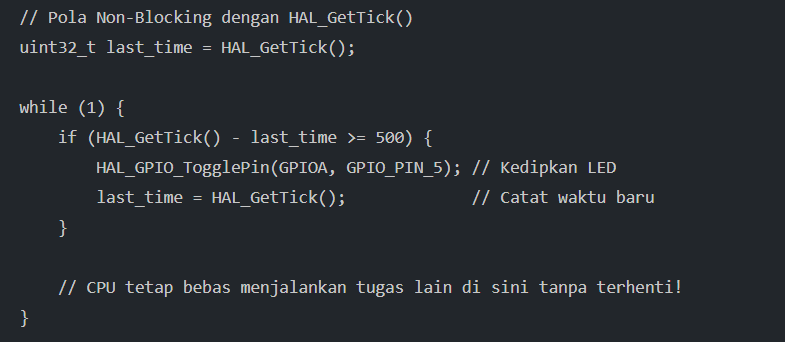

# Catatan 2026-09-22

STM32, sebuah mikrokontroler, memiliki tiga bagian utama, yaitu:
- **Flash Memory (“Hard Disk”)**: Tempat menyimpan kode program yang sudah jadi (`.elf`/`.bin`). Bersifat non-volatile (data tidak akan hilang meskipun daya listrik dimatikan).
- **SRAM (“RAM”)**: Tempat menyimpan variabel sementara saat program sedang berjalan. Bersifat volatile (hilang saat mati listrik).
- **Peripherals**: “Organ/Kaki-Tangan” mikrokontroler yang terhubung ke dunia luar, seperti GPIO (pin sakelar), Timer (pewaktu), UART (komunikasi serial), dan ADC (pengukur sinyal analog).

---

Ketika build suatu program di IDE, ada beberapa alat (toolchain) yang bekerja secara berurutan:
1. **STM32CubeMX**: Mengatur fungsi fisik pin dan frekuensi clock secara visual, lalu menghasilkan kode inisialisasi awal serta file aturan build `CMakeLists.txt`.
2. **arm-none-eabi-gcc**: Menerjemahkan bahasa C manusia menjadi bahasa mesin ARM.
3. **Linker & Linker Script (`.ld`)**: Menyusun peta memori: meletakkan kode di flash & variabel di SRAM.

---

## GPIO
GPIO adalah pin serbaguna untuk membaca atau mengirim sinyal digital.

### Mode Output (Mengirim Sinyal)
- **Push-Pull**: Pin secara aktif dapat mengeluarkan tegangan HIGH (3.3V) atau LOW (0V).
- **Open-Drain**: Pin hanya bisa menarik tegangan ke LOW (0V) atau dibiarkan “mengambang” (*high-impedance*), sehingga membutuhkan resistor pull-up eksternal.

### Mode Input (Membaca Sinyal)
- **Pull-Up**: Pin dihubungkan ke 3.3V. Kondisi default-nya adalah HIGH, dan akan menjadi LOW saat tombol ditekan ke Ground (GND).
- **Pull-Down**: Pin dihubungkan ke GND via resistor internal. Kondisi default-nya adalah LOW, dan akan menjadi HIGH saat tombol ditekan ke 3.3V.

---

## Pewaktuan: Blocking (`HAL_Delay`) vs Non-Blocking (`HAL_GetTick`)
- **`HAL_Delay(1000)` (Blocking/Penghenti)**: Fungsi ini membuat CPU berhenti di tempat selama 1 detik. CPU tidak bisa melakukan pekerjaan lain selama jeda ini (misalnya membaca tombol atau mendeteksi bahaya).
- **`HAL_GetTick()` (Non-Blocking)**: Bekerja seperti melihat jam tangan secara berkala. CPU terus berjalan menjalankan program utama, lalu mengecek apakah selisih waktu sekarang dengan catatan waktu sebelumnya sudah melampaui interval tertentu.



Pola non-blocking memungkinkan untuk mengedipkan dua LED pada kecepatan berbeda secara bersamaan dalam satu superloop `while(1)`.

---

## Mechanical Bounce & Software Debouncing
Saat sakelar/tombol mekanis ditekan, plat logam di dalamnya tidak langsung menempel sempurna, melainkan membal (*bounce*) beberapa kali dalam hitungan milidetik.

Mikrokontroler yang bekerja orde jutaan instruksi per detik akan menganggap balasan mekanis ini sebagai tombol yang ditekan 5-10 kali berturut-turut.

Software debouncing adalah teknik di mana firmware membaca input tombol, lalu memberi jeda verifikasi singkat (misalnya 10-20 ms) untuk memastikan sinyal listrik sudah stabil sebelum mengeksekusi perintah. Penekanan tombol bisa dideteksi pada transisi Falling Edge (berubah dari HIGH ke LOW) atau Rising Edge (berubah dari LOW ke HIGH).

---

## Debugging
- Memasang breakpoint pada baris kode (misalnya pada fungsi tombol) agar eksekusi program berhenti tepat di titik tersebut.
- Menggunakan live watch untuk memeriksa nilai variabel dalam RAM secara real-time.
- Memeriksa status register fisik GPIO pada jendela peripheral view.

### Langkah Debugging
Siapkan file `.svd` dan `launch.json`.

File SVD (*system view description*) adalah file XML yang memetakan seluruh alamat fisik register mikrokontroler ke tampilan grafis. Template `launch.json`:

```json
{
  "version": "0.2.0",
  "configurations": [
    {
      "name": "Cortex Debug (ST-LINK)",
      "type": "cortex-debug",
      "request": "launch",
      "servertype": "stlink",
      "executable": "${workspaceFolder}/build/Praktik_Day1_CubeMX.elf",
      "device": "STM32G474RE",
      "svdFile": "${workspaceFolder}/STM32G474.svd",
      "runToEntryPoint": "main"
    }
  ]
}
```

- Pasang breakpoint di button handler. Klik pada margin kiri sampai muncul titik merah (Breakpoint). Tekan F5 untuk memulai sesi debug.
- Pantau bahwa ketika breakpoint terjadi, VS Code akan berhenti tepat di baris breakpoint.
- Register juga bisa dipantau di peripheral.
- Variabel bisa diamati di bagian Watch.

---

## Setup Environment

### Install STM32CubeCLT
STM32CubeCLT (*command line tools*) merupakan paket yang terdiri dari:
- ARM GCC Compiler (`arm-none-eabi-gcc`)
- CMake & Ninja Build Tools
- ST-LINK GDB Server & STM32CubeProgrammer CLI

### Pasang 4 Ekstensi di VS Code
1. **C/C++** (oleh Microsoft) untuk sintaks & autocompletion kode C
2. **CMake Tools** (oleh Microsoft) untuk mengelola konfigurasi dan proses build
3. **Cortex-Debug** (oleh marus25) untuk debugging via ST-LINK/GDB Server
4. **Serial Monitor** (oleh Microsoft) untuk membaca output serial UART langsung di VS Code

### Ekspor proyek dari STM32CubeMX sebagai CMake
1. Buka file `.ioc` proyek.
2. Klik tab **Project Manager**.
3. Pada kolom **Toolchain/IDE**, ubah pilihannya menjadi **CMake**.
4. Klik **Generate Code** (CubeMX akan menghasilkan folder proyek yang berisi berkas `CMakeLists.txt` dan berkas toolchain `cmake/gcc-arm-none-eabi.cmake`).

### Uji dan Verifikasi
Setelah installer STM32CubeCLT selesai dan VS Code di-restart, buka terminal lalu ketik perintah verifikasi berikut:
```bash
arm-none-eabi-gcc --version
cmake --version
ninja --version
```

---

## Anatomi CMakeLists.txt

### Inisialisasi Proyek & Toolchain
```cmake
cmake_minimum_required(VERSION 3.22)

# nama proyek dan bahasa yang digunakan (C, C++, Assembly)
project(Praktik_Day1_CubeMX)
enable_language(C ASM)
# bisa juga
project(Praktik_Day1_CubeMX C ASM)
```

### Parameter Chip & Compiler Flags (`target_compile_definitions`)
Memberi tahu compiler jenis chip yang digunakan dan agar library HAL diaktifkan:
```cmake
target_compile_definitions(${PROJECT_NAME} PRIVATE
    USE_HAL_DRIVER
    STM32G474xx # Memilih definisi register spesifik untuk STM32G474
)
```

### Daftar Path Header/File .h (`target_include_directories`)
Memberi tahu compiler di folder mana ia harus mencari berkas pustaka/header:
```cmake
target_include_directories(${PROJECT_NAME} PRIVATE
    Core/Inc
    Drivers/STM32G4xx_HAL_Driver/Inc
    Drivers/CMSIS/Device/ST/STM32G4xx/Include
    Drivers/CMSIS/Include
)
```

### Rujukan Berkas Linker Script (`target_link_options`)
Menghubungkan berkas lokasi memori `.ld` (Linker Script) agar compiler tahu alamat Flash dan SRAM:
```cmake
target_link_options(${PROJECT_NAME} PRIVATE
    -T${CMAKE_CURRENT_SOURCE_DIR}/STM32G474RETX_FLASH.ld
    -Wl,-Map=${PROJECT_NAME}.map
)
```

### Daftar Berkas Sumber C & Assembly (`target_sources/add_executable`)
Daftar seluruh berkas `.c` dan `.s` yang akan dikompilasi menjadi satu kesatuan:
```cmake
target_sources(${PROJECT_NAME} PRIVATE
    Core/Src/main.c
    Core/Src/stm32g4xx_hal_msp.c
    Core/Src/stm32g4xx_it.c
    Core/Src/system_stm32g4xx.c
    # ... Berkas driver HAL lainnya
    Core/Startup/startup_stm32g474retx.s
)
```

---

## Embedded C Refresher

### Tipe Data Integer Berukuran Pasti (`<stdint.h>`)
Tipe data ini dipakai untuk menjamin portabilitas kode agar lebar bit variabel selalu konsisten di berbagai platform:
- `uint8_t` / `int8_t` (8-bit / 1 Byte)
- `uint16_t` / `int16_t` (16-bit / 2 Byte)
- `uint32_t` / `int32_t` (32-bit / 4 Byte)
- `uint64_t` / `int64_t` (64-bit / 8 Byte)

### Used Functions
- `HAL_GetTick()`: Untuk mendapatkan tick (sinyal detak periodik) terkini
- `HAL_GPIO_ReadPin()`: Untuk membaca input
- `HAL_GPIO_WritePin()`
- `HAL_GPIO_TogglePin()`
